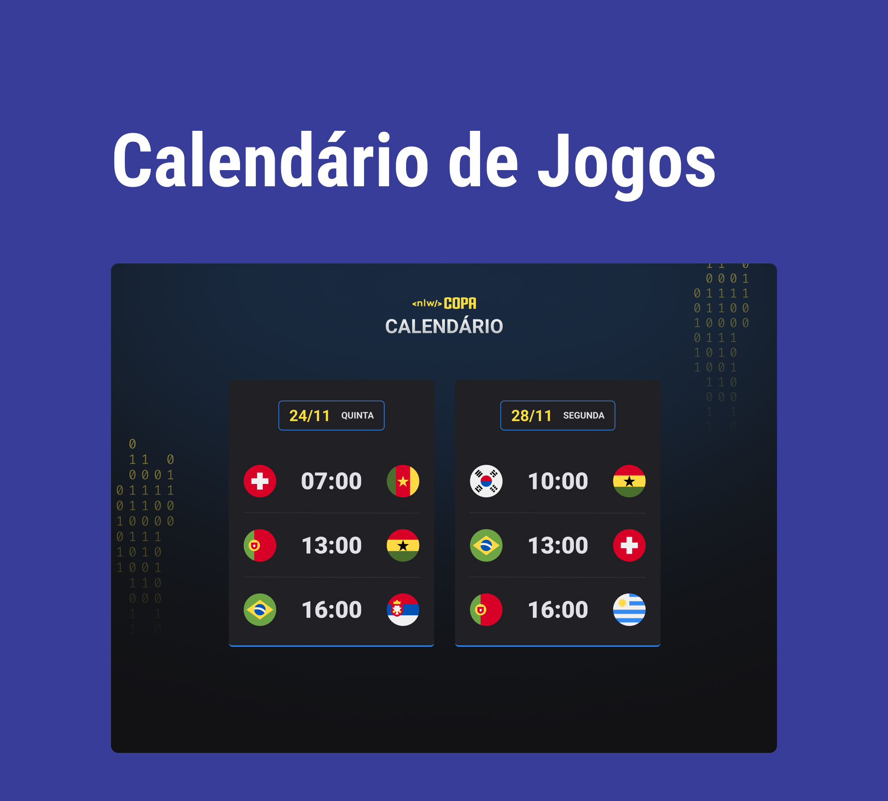

<h1 align="center"> Projero Calendário Copa </h1>

Um projetinho sobre o calendário de jogos do Brasil que houve na copa de 2022.

  <a href="#-tecnologias">Tecnologias</a>&nbsp;&nbsp;&nbsp;|&nbsp;&nbsp;&nbsp;
  <a href="#memo-licença">Licença</a>

  

 

  

## 🚀 Tecnologias

Esse projeto foi desenvolvido com as seguintes tecnologias:

- HTML e CSS
- JavaScript
- Git e Github

## :memo: Licença

Esse projeto está sob a licença MIT.